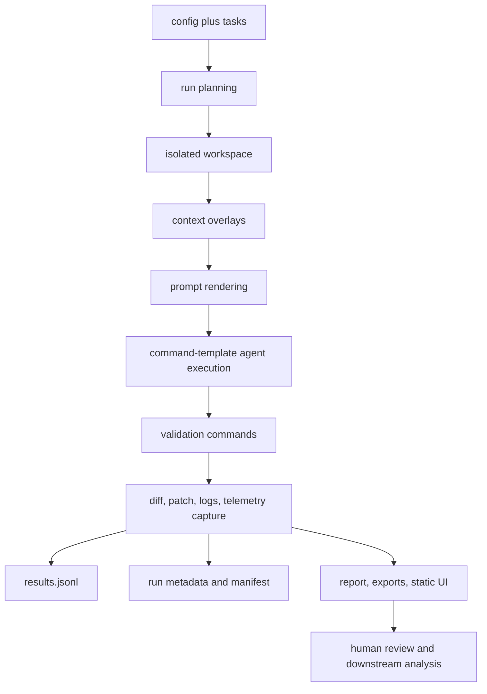

# Architecture

[Back to documentation index](index.md).

context-eval is a local runner and artifact analysis tool. It prepares isolated
workspaces, overlays selected context assets, executes a configured local agent
command, runs validation commands, and writes reviewable artifacts.

## Text Architecture Diagram

```text
context-eval.yaml + tasks.yaml
  -> run planning
  -> isolated Git workspace per case
  -> context overlays
  -> prompt rendering
  -> command-template agent execution
  -> validation commands
  -> diff, patch, logs, telemetry capture
  -> results.jsonl + run_metadata.json + run_manifest.json
  -> report.md + CSV export + compact JSON export + static UI
  -> optional loopback local app surfaces selected local files and runs
```

## Mermaid Diagram



If Mermaid is not rendered, the text diagram above is the source of truth.

## Runtime Flow

The loaded config and task file define the target repository, base ref, task
prompts, context variants, command-template agent configuration, validation
commands, trials, jobs, cleanup policy, and output directory.

Run planning expands those inputs into a deterministic case matrix. For each
case, context-eval prepares an isolated Git workspace, applies the selected
context overlays, renders a prompt file, and runs the configured local command
template from that workspace.

After agent execution, context-eval runs the selected validation commands,
captures stdout and stderr logs, records timeout and validation status, saves
patch and diff stats, collects optional telemetry from local artifacts, and
writes result rows plus run metadata.

## Runtime Package Boundary

`context_eval/` is the runtime Python package. It contains the CLI, config
loader, runner, adapters, reporting, export, static UI rendering, and local app
server code.

`.agents/`, `.codex/skills/`, `openspec/`, and `scripts/` are maintainer
capability library files. They support development, validation, release
preparation, and project maintenance. They are not runtime package modules and
are not part of the target repository evaluation surface.

## Static UI And Local App Mode

`context-eval ui` creates a static, self-contained HTML file from local config
and run artifacts. It is offline and export-only. It can show config, matrix,
validation feedback, results, risk signals, and generated YAML, but it cannot
save back to source files, run validation commands, or start agents.

`context-eval app` is an explicit loopback local app mode. It can save selected
local files, run side-effect-free preflight checks, start local evaluations
after explicit confirmation, stream logs, inspect artifacts, and produce
exports. It is not a hosted service and does not create shared accounts or
remote dashboards.

## Artifact-Only Reporting

Reports, terminal summaries, exports, and static UI views read recorded local
artifacts. They do not rerun agents, scrape logs to guess missing telemetry,
call hosted services, or infer correctness beyond validation output and human
review.

The primary artifact sources are `results.jsonl`, `run_metadata.json`, and
`run_manifest.json`. Reports and exports are reproducible from those recorded
files and the case-local artifacts they reference.

## Why This Is Not An Agent Leaderboard

context-eval evaluates the effect of context variants under a recorded local
setup. Repo state, task selection, command template, local agent configuration,
validation commands, machine state, trials, and telemetry availability all
shape the output.

For that reason, results are local observations. They are useful for deciding
whether a context asset helped a specific engineering workflow. They are not
global rankings and should not be presented as absolute model capability.
